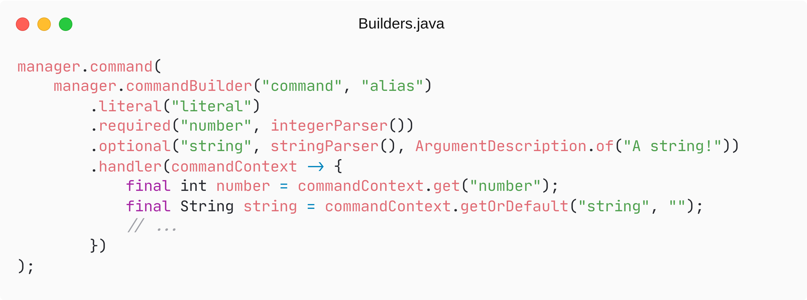
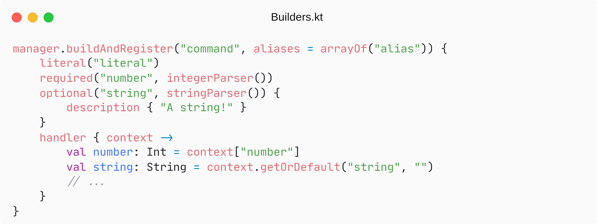
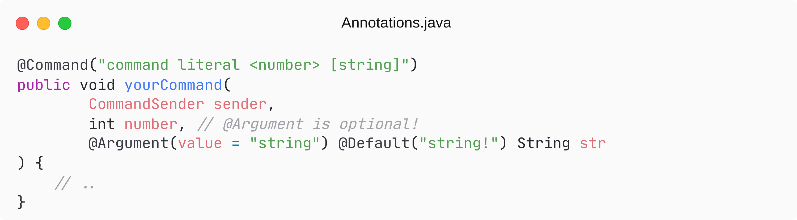

 
<h1>cloud command framework</h1>

> [!NOTE]
> Cloud 2 is a major update with many significant changes. Cloud 2 is _not_ compatible with version 1.
> You can find the changelog [here](https://cloud.incendo.org/en/latest/cloud-v2/).

Cloud is a general-purpose Java command dispatcher &amp; framework. It allows programmers to define command chains that are then parsed and invoked from user-supplied string inputs, to execute pre-defined actions.

Cloud commands consist out of deterministic chains of strongly typed arguments. When you define a command,
you know exactly what type of data you're going to be working with, and you know that there will be no
ambiguity at runtime. Cloud promotes writing reusable code, making it very easy to define new commands.

Cloud allows you to build commands in many different ways, according to your preferences:

<picture>
    <source media="(prefers-color-scheme: dark)" srcset="img/code/builder_java_dark.png">
    <source media="(prefers-color-scheme: light)" srcset="img/code/builder_java_light.png">
    
</picture>

<picture>
    <source media="(prefers-color-scheme: dark)" srcset="img/code/builder_kotlin_dark.png">
    <source media="(prefers-color-scheme: light)" srcset="img/code/builder_kotlin_light.png">
    
</picture>

<picture>
    <source media="(prefers-color-scheme: dark)" srcset="img/code/annotations_java_dark.png">
    <source media="(prefers-color-scheme: light)" srcset="img/code/annotations_java_light.png">
    
</picture>

<picture>
    <source media="(prefers-color-scheme: dark)" srcset="img/code/annotations_kotlin_dark.png">
    <source media="(prefers-color-scheme: light)" srcset="img/code/annotations_kotlin_light.png">
    
</picture>

Cloud is built to be very customisable, in order to fit your needs. You can inject handlers and processors
along the entire command chain. If the pre-existing command parsers aren't enough for your needs, you're easily
able to create your own parsers. If you use the annotation parsing system, you can also define your own annotations
and register them to further customise the behaviour of the library.

Cloud by default ships with implementations and mappings for the most common Minecraft server platforms, 
Discord4J, JDA4, JDA5, Kord and Javacord for
Discord bots, PircBotX for IRC and [cloud-spring](https://github.com/incendo/cloud-spring) for Spring Shell.
The core module allows you to use Cloud anywhere, simply by implementing the CommandManager for the platform of your choice.

## links  

- JavaDoc: https://javadoc.io/doc/org.incendo.cloud
- Docs: https://cloud.incendo.org
- Incendo Discord: https://discord.gg/aykZu32

### repositories

- [cloud](https://github.com/incendo/cloud) - main repository
- [cloud-minecraft](https://github.com/incendo/cloud-minecraft) - cloud implementations for minecraft
- [cloud-minecraft-modded](https://github.com/incendo/cloud-minecraft-modded) - cloud implementations for modded minecraft
- [cloud-discord](https://github.com/incendo/cloud-discord) - cloud implementations for discord
- [cloud-spring](https://github.com/incendo/cloud-spring) - cloud implementation for spring-shell
- [cloud-processors](https://github.com/incendo/cloud-processors) - extra pre- & postprocessors
- [cloud-build-logic](https://github.com/incendo/cloud-build-logic) - gradle plugin for building cloud
- [cloud-docs](https://github.com/incendo/cloud-docs) - documentation sources
  
## develop &amp; build  
  
To clone the repository, use `git clone https://github.com/Incendo/cloud.git`.

To then build it, use `./gradlew clean build`. If you want to build the examples as well, use `./gradlew clean build
-Pcompile-examples`.

## attributions, links &amp; acknowledgements  
  
This library is licensed under the <a href="https://opensource.org/licenses/MIT">MIT</a> license, and the code copyright  belongs to Alexander Söderberg. The implementation is based on a paper written by the copyright holder, and this paper exists under the <a href="https://creativecommons.org/licenses/by/4.0/legalcode">CC Attribution 4</a> license.  
  
The <a href="https://iconscout.com/icons/cloud" target="_blank">Cloud</a> icon was created by <a href="https://iconscout.com/contributors/oviyan">
Thanga Vignesh P</a> on <a href="https://iconscout.com">Iconscout</a> and Digital rights were purchased under a premium plan.
