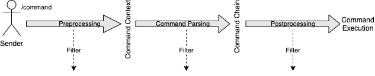

= Cloud documentation
Alexander Söderberg <contact@alexander-soderberg.com>
v0.1.0, 2020-12-30
:sectnums:
:cloud-version: 1.7.1
:toc: left
:toclevels: 4
:icons: font
:hide-uri-scheme:
:source-highlighter: coderay
:coderay-linenums-mode: inline
:coderay-css: class

== Introduction to Cloud

CAUTION: The Cloud documentation is still a work in progress.

Cloud is a command manager and dispatcher for the JVM. Cloud allows you to define commands in
several ways, most notably using command builders, or annotations. Cloud has platform implementations
for many platforms, including Minecraft server software such as Bukkit or Discord bot frameworks
such as JDA.

Cloud allows you to customize the command execution pipeline by injecting custom behaviour along
the entire execution path. All of this will be covered in this document.

This document will first introduce different Cloud concepts using the builder pattern API.
Section 4 will expand upon this by introducing the annotation (declarative) API, which offers
another way of declaring commands.

This document will not cover every specific detail of Cloud. Instead, the purpose of
this document is to give an introduction to various Cloud concepts and explain how they
can be used to build useful commands. It is very recommended to read the
https://javadoc.io/doc/cloud.commandframework[JavaDocs] and use them as the primary source of information.

== Getting Started

Cloud is available through https://search.maven.org/search?q=cloud.commandframework[Maven Central].

*Maven*
[source,xml,subs="attributes,verbatim"]
----
<dependency>
    <groupId>cloud.commandframework</groupId>
    <artifactId>cloud-core</artifactId>
    <version>{cloud-version}</version>
</dependency>
----

*Gradle (Groovy)*
[source,groovy,subs="attributes,verbatim"]
----
implementation 'cloud.commandframework:cloud-core:{cloud-version}'
----

*Gradle (Kotlin)*
[source,kotlin,subs="attributes,verbatim"]
----
implementation("cloud.commandframework:cloud-core:{cloud-version}")
----

If you want to use snapshot builds, then they are available the Sonatype snapshots repository:

[source,xml]
----
<repository>
 <id>sonatype-snapshots</id>
 <url>https://oss.sonatype.org/content/repositories/snapshots</url>
</repository>
----

=== Modules

cloud-core:: Core Cloud API module.

cloud-annotations:: Cloud annotation API.

cloud-services:: Cloud service API. Included in Core.

cloud-tasks:: Cloud scheduling API.

cloud-kotlin-extensions:: Cloud extensions for Kotlin.

cloud-bukkit:: Cloud implementation for the Bukkit API.

cloud-paper:: Extension of cloud-bukkit for the Paper API.

cloud-velocity:: Cloud implementation for the Velocity (1.1.0+) API.

cloud-brigadier:: Cloud utilities for Mojang's Brigadier API.

cloud-bungee:: Cloud implementation for the BungeeCord API.

cloud-fabric:: Cloud implementation for Minecraft clients and servers using the Fabric mod loader and API.

cloud-jda:: Cloud implementation for the JDA API.

cloud-javacord:: Cloud implementation for the Javacord API.

cloud-pircbotx:: Cloud implementation for the PircBotX framework.

cloud-sponge7:: Cloud implementation for Sponge v7.

== Core

The core module contains the majority of the API that you will be interacting with when using
Cloud.

=== Command Manager

The first step to any Cloud project is to create a command manager. Each supported platform has
its own command manager, but for the most part they look and behave very similarly. It is possible
to support multiple platforms in the same project.

All command managers have a generic type argument for the command sender type. Most platforms have
their own "native" command sender type, but Cloud allows you to use whatever sender you want, by
supplying a mapping function to the command manager. This sender type will be included in the command context,
which you will be interacting with a lot when using Cloud.

[title=Creating a command manager instance using Bukkit]
====
This particular example uses `cloud-bukkit`, though most concepts transfer over to the other command mangers.

[source,java]
----
CommandManager<CommandSender> manager = new BukkitCommandManager<>(
        /* Owning plugin */ this,
        CommandExecutionCoordinator.simpleCoordinator(), <1>
        Function.identity(), <2>
        Function.identity(), <3>
);
----
<1> The execution coordinator handles the coordination of command parsing and execution. You can read more about this
in section 3.6.
<2> Function that maps the platform command sender to your command sender.
<3> Function that maps your command sender to the platform command sender.
====

The command manager is used to register commands, create builders, change command settings, etc.
More information can be found in the CommandManager
https://javadoc.io/doc/cloud.commandframework/cloud-core/latest/cloud/commandframework/CommandManager.html[JavaDoc].

=== Commands

Commands consist of chains of arguments that are parsed from user input. These arguments
can be either static literals or variables. Variable arguments are parsed into different
types using argument parsers. Variable arguments may be either required, or they can be
optional. Optional arguments may have default values.

[title=Example command structure]
====
[source]
----
/foo bar one
/foo bar two <arg>
/foo <arg> <1>
----
<1> When a variable argument is present next to literals, it will be allowed to catch any
input that isn't caught by the literals. Only one variable may exist at any level, but
there may be many literals.

This example contains three unique commands.
====

=== Argument Types

==== Literals

Literals are fixed strings and can be used to create "subcommands". You may use
however many command literals you want at any level of a command. Command literals
may have additional aliases that correspond to the same argument.

A literal can be created directly in the command builder:

[source,java]
----
builder = builder.literal(
        "main", <1>
        "alias1", "alias2", "alias3" <2>
);
----
<1> Any literal must have a main "alias".
<2> You may also specify additional aliases. These are optional.

You can also attach a description to your node, which is used in the command
help system:

[source,java]
----
builder = builder.literal(
        "main",
        Description.of("Your Description")
);
----

Literals may also be created using the
https://javadoc.io/doc/cloud.commandframework/cloud-core/latest/cloud/commandframework/arguments/StaticArgument.html[StaticArgument]
class.

==== Standard

Cloud has built in support for all primitive types, as well as some other commonly
used argument types.

===== string

There are three different types of string arguments:

single:: A single string without any blank spaces.

greedy:: Consumes all remaining input.

quoted:: Consumes either a single string, or a string surrounded by `"` or `'`.

String arguments can be constructed using:

* `StringArgument.of(name)`: Required single string argument

* `StringArgument.of(name, mode)`: Required string argument of specified type

* `StringArgument.optional(name)`: Optional single string argument

* `StringArgument.optional(name, mode)`: Optional string argument of specified type

Furthermore, a string argument builder can be constructed using `StringArgument.builder(name)`.
This allows you to provide a custom suggestion generator, using `StringArgument.Builder#withSuggestionProvider(BiFunction<CommandContext<C>, List<String>>)`.

===== byte/short/int/long

There are four different integer argument types:

- byte
- short
- int
- long

All integer types are created the same way, the only difference is the class. These examples will use `IntegerArgument`, but the same
methods are available in `ByteArgument`, `ShortArgument`, and `LongArgument`.

Integer arguments can be constructed using:

* `IntegerArgument.of(name)`: Required integer argument without a range

* `IntegerArgument.optional(name)`: Optional integer argument without a range

* `IntegerArgument.optional(name, default)`: Optional integer argument without a range, with a default value

Furthermore, an integer argument builder can be constructed using `IntegerArgument.builder(name)`. This allows you to provide a
 custom suggestion generator, using `IntegerArgument.Builder#withSuggestionProvider(SuggestionProvider<C>)`, and set minimum and
 maximum values.

===== float/double

There are two different floating point argument types:

- float
- double

All floating point types are created the same way, the only difference is the class. These examples will use `FloatArgument`, but the same
methods are available in `DoubleArgument`.

Floating point arguments can be constructed using:

* `FloatArgument.of(name)`: Required float argument without a range

* `FloatArgument.optional(name)`: Optional float argument without a range

* `FloatArgument.optional(name, default)`: Optional float argument without a range, with a default value

Furthermore, a floating-point argument builder can be constructed using `FloatArgument.builder(name)`. This allows you to
provide a custom suggestion generator, using `FloatArgument.Builder#withSuggestionProvider(SuggestionProvider<C>)`, and set
minimum and maximum values.

===== enums

The enum argument type allows you to create a command argument using any enum type. They can be created using `EnumArgument.of`
and `EnumArgument.optional`. The parser accepts case independent values and suggestions will be created for you.

===== boolean

The boolean argument type is very simple. It parses boolean-like values from the input. There are two different modes:

liberal:: Accepts truthy values ("true", "yes", "on") and falsy values ("false", "no", off")
non-liberal:: Accepts only "true" and "false"

===== compound arguments

Compound arguments are a special type of arguments that consists of multiple other arguments.
By default, 2 or 3 arguments may be used in a compound argument.

The methods for creating compounds arguments can be found in CommandManager, or in the
https://javadoc.io/doc/cloud.commandframework/cloud-core/latest/cloud/commandframework/arguments/compound/ArgumentPair.html[ArgumentPair]
or
https://javadoc.io/doc/cloud.commandframework/cloud-core/latest/cloud/commandframework/arguments/compound/ArgumentTriplet.html[ArgumentTriplet]
classes.

In general, they need a tuple of names, and a tuple of argument types. They can also
take in a mapping function which maps the value to a more user-friendly type.

[title=Argument triplet mapping to a vector]
====
[source,java]
----
commandBuilder.argumentTriplet(
        "coords",
        TypeToken.get(Vector.class),
        Triplet.of("x", "y", "z"),
        Triplet.of(Integer.class, Integer.class, Integer.class),
        (sender, triplet) -> new Vector(triplet.getFirst(), triplet.getSecond(),
                triplet.getThird()
        ),
        Description.of("Coordinates")
)
----
====

==== Custom

Cloud allows you to create custom argument parsers. The easiest way to achieve this
is by extending `CommandArgument<C, YourType>`. This is recommended if you are creating
arguments that will be exposed in some kind of library. For inspiration on how
to achieve this, it is recommended to check out the standard Cloud arguments.

If you don't need to expose your parser as a part of an API, you may simply
implement `ArgumentParser<C, YourType>`. The method you will be working with
looks like:

[source,java]
----
public @NonNull ArgumentParseResult<YourType> parse(
            @NonNull CommandContext<@NonNull C> commandContext,
            @NonNull Queue<@NonNull String> inputQueue <1>
) {
    // ...
}
----
<1> Queue containing (remaining) user input.

When reading an argument you should do the following:

1. Peek the queue.
2. Attempt to parse your object.
    * If the object could not be parsed, return `ArgumentParseResult.failure(exception)`
3. If the object was parsed successfully, pop a string from the queue.
4. Return `ArgumentParseResult.success(object)`.

WARNING: If the read string(s) isn't popped from the queue, then the command engine will assume that the syntax is wrong and
send an error message to the command sender.

It is highly recommended to make use of
https://javadoc.io/doc/cloud.commandframework/cloud-core/latest/cloud/commandframework/exceptions/parsing/ParserException.html[ParserException]
when returning a failed result. This allows for integration with the Cloud caption system (refer to the section on Exception
Handling for more information).

You should - in most cases - register your parser to the
https://javadoc.io/doc/cloud.commandframework/cloud-core/latest/cloud/commandframework/arguments/parser/ParserRegistry.html[ParserRegistry]
which you can access using
https://javadoc.io/doc/cloud.commandframework/cloud-core/latest/cloud/commandframework/CommandManager.html#getParserRegistry()[CommandManager#getParserRegistry()].
If you are registering a parser that shouldn't be the default for the
argument type, then it is recommended to register a named parser.
If your parser is not registered to the parser registry, it will
not be usable in annotated command methods.

When registering a command parser, you're actually registering a
function that will generate a parser based on parser parameters.
These parameters can be used together with the annotation system
to differentiate between different parsers and also change parser
settings. In order to create these parameters you can create
an annotation mapper using
https://javadoc.io/doc/cloud.commandframework/cloud-core/latest/cloud/commandframework/arguments/parser/ParserRegistry.html#registerAnnotationMapper(java.lang.Class,java.util.function.BiFunction)[ParserRegistry#registerAnnotationMapper].

Here's an example of how a UUID parser can be created and registered:

[title=Example UUID parser]
====
This example is taken from
https://javadoc.io/doc/cloud.commandframework/cloud-core/latest/cloud/commandframework/arguments/standard/UUIDArgument.html[UUIDArgument.java]
, which also includes a custom exception and argument builder.
It's a good reference class for custom arguments, as it does
not contain any complicated logic.

[source,java]
----
public final class UUIDParser<C> implements ArgumentParser<C, UUID> {

    @Override
    public @NonNull ArgumentParseResult<UUID> parse(
            final String input = inputQueue.peek();
            if (input == null) {
                return ArgumentParseResult.failure(new  NoInputProvidedException(
                        UUIDParser.class,
                        commandContext
                ));
            }

            try {
                UUID uuid = UUID.fromString(input);
                inputQueue.remove();
                return ArgumentParseResult.success(uuid);
            } catch(final IllegalArgumentException e) {
                return ArgumentParseResult.failure(new UUIDParseException(input, commandContext));
            }
    )

}
----

It is then registered to the parser registry using
[source,java]
----
parserRegistry.registerParserSupplier(
    TypeToken.get(UUID.class),
    options -> new UUIDParser<>()
);
----
in
https://github.com/Incendo/cloud/blob/master/cloud-core/src/main/java/cloud/commandframework/arguments/parser/StandardParserRegistry.java[StandardParserRegistry.java].

====

==== Flags

Flags are named optional values that can either have an associated argument (value flag) or have the value evaluated by whether the flag is present (presence flag). These flags are registered much the same way as normal arguments, only that you use `.flag` methods in the command builder instead.

Flags are always optional. You cannot have required flags. If you need required values, then they should be part of a deterministic command chain. Flags must also necessarily be placed at the tail of a command chain, and you cannot put any arguments (required, or optional) after the flags. This is enforced by the command builder.

Flags can have aliases alongside their full names. When referring to the full name of a flag, you use `--name` whereas an alias
uses syntax similar to `-a`. You can chain the aliases of multiple presence flags together, such that `-a -b -c` is equivalent
to `-abc`.

[title=Example of a presence flag]
====
[source,java]
----
manager.command(
    manager.commandBuilder("cp")
        .argument(StringArgument.of("source"), ArgumentDescription.of("Source path"))
        .argument(StringArgument.of("destination"), ArgumentDescription.of("Destination path"))
        .flag(
            manager.flagBuilder("recursive")
                .withAliases("r")
                .withDescription(ArgumentDescription.of("Recursive copy"))
        ).handler(context -> {
           boolean recursive = context.flags().isPresent("recursive");
           // ...
        })
);
----
====

[title=Example of a value flag]
====
In this example the flag is constructed outside the command builder,
and referenced using the flag object itself. Flag objects are also
reusable across multiple commands (unlike command arguments).

[source,java]
----
final CommandFlag<Float> yawFlag = CommandFlag
    .builder("yaw")
    .withArgument(FloatArgument.of("yaw"))
    .build();
manager.command(
    manager.commandBuilder("teleport")
        .argumentTriplet(
            "vector",
            Triplet.of("x", "y", "z"),
            Triplet.of(Double.class, Double.class, Double.class),
            ArgumentDescription.of("The position to teleport to")
        )
        .flag(yawFlag)
        .handler(context -> {
            // ...
            final float yaw = context.flags().getValue(yawFlag, 0f);
            // ...
    })
);
----
====

==== Argument Preprocessing

An argument preprocessor is a function that gets to act on command
input before it's given to a command. This allows you to inject
custom verification behaviour into existing parsers, or register
annotations that add extra verification to your custom annotations.

https://github.com/Incendo/cloud/blob/master/cloud-core/src/main/java/cloud/commandframework/arguments/preprocessor/RegexPreprocessor.java[RegexPreprocessor.java]
is a good example of a preprocessor that allows you to add regular
expression checking to your arguments.

Argument preprocessors can be applied to created arguments using
https://javadoc.io/doc/cloud.commandframework/cloud-core/latest/cloud/commandframework/arguments/CommandArgument.html#addPreprocessor(java.util.function.BiFunction)(java.util.function.BiFunction)[CommandArgument#addPreprocessor].

=== Suggestions

Many platforms support command suggestions. You can add command suggestions to your command parser, by overriding the suggestion
method:

[source,java]
----
@Override
public @NonNull List<@NonNull String> suggestions(
        final @NonNull CommandContext<C> commandContext,
        final @NonNull String input
) {
    final List<String> completions = new ArrayList<>();
    for (Material value : Material.values()) {
        completions.add(value.name().toLowerCase());
    }
    return completions;
}
----

or by specifying a suggestion function in a command argument builder
using
https://javadoc.io/doc/cloud.commandframework/cloud-core/latest/cloud/commandframework/arguments/CommandArgument.Builder.html#withSuggestionProvider(java.util.function.BiFunction)[CommandArgument.Builder#withSuggestionProvider].

You also register a standalone suggestions to the parser registry,
using
https://javadoc.io/doc/cloud.commandframework/cloud-core/latest/cloud/commandframework/arguments/parser/ParserRegistry.html#registerSuggestionProvider(java.lang.String,java.util.function.BiFunction)[ParserRegistry#registerSuggestionProvider].
Registering a named suggestion provider allows it to be used in
annotated command methods, or retrieved using `ParserRegistry#getSuggestionProvider`.

=== Injection Points

When a command is entered by a command sender, it goes through
the following stages:

1. It is turned into string tokens. This is used to create the input queue.
2. A command context is created for the input queue combined with the command sender.
3. The command is passed to the preprocessors, which may alter the input queue or write to the context.
    * If a preprocessor causes an interrupt using `ConsumerService.interrupt()` then the context will be filtered out and the
command will not be parsed.
    * If no preprocessor filters out the context, the context and input will be ready to be parsed into an executable command.
4. The input is parsed into a command chain and components are written
to the context.
    * If the command does not fit any existing command chains, the sender is notified and the parsing is cancelled.
    * If the command is valid, it will be sent to the postprocessors.
5. The command postprocessors get to act on the command can alter the command context. they may now postpone command execution,
such is the case with the command confirmation postprocessor.
    * If a postprocessor causes an interrupt using `ConsumerService.interrupt()` the command will not be executed.
    * If no postprocessor interrupts during the post-processing stage, the command will be sent to the executor.
6. The command is executed using the command executor.

==== Preprocessing

Command preprocessing happens before the input has been pasted to the command tree for parsing. To register a preprocessor, implement `cloud.commandframework.execution.preprocessor.CommandPreProcessor`:

[source,java]
----
public class YourPreProcessor<C> implements CommandPreprocessor<C> {

    @Override
    public void accept(final CommandPreprocessingContext<C> context) {
        /* Act on the context */
        if (yourCondition) {
            /* Filter out the context so that it is never passed to the parser */
            ConsumerService.interrupt();
        }
    }

}
----

Then register the preprocessor using `CommandManager#registerCommandPreProcessor(CommandPreprocessor<C>)`.

==== Postprocessing

Command postprocessing happen after the input has been parsed into a command chain, but before the command is executed. To register a postprocessor, implement `cloud.commandframework.execution.postprocessor.CommandPostProcessor`:

[source,java]
----
public class YourPostprocessor<C> implements CommandPostprocessor<C> {

    @Override
    public void accept(final CommandPostprocessingContext<C> context) {
        /* Act on the context */
        if (yourCondition) {
            /* Filter out the context so that it is never passed to the executor */
            ConsumerService.interrupt();
        }
    }

}
----

Then register the postprocessor using `CommandManager#registerCommandPostProcessor(CommandPostprocessor<C>)`.

=== Execution Coordinators
TODO

=== Command Proxies

Command proxying is a feature that allows you to forward a command chain
to another command chain. More specifically, a "proxy" of a command is a command
which has all the same required arguments in the same order as in the
original command. Essentially, they can be thought of as more powerful
command aliases.

It is easier understood by an example. Imagine you have a warp command in a game,
let's call it `/game warp me <warp>`, but you feel like it's a little too verbose for common use. You may then choose to introduce
a `/warpme <warp>` command proxy that gets forwarded to the original command.

To create a command proxy you can use
https://javadoc.io/doc/cloud.commandframework/cloud-core/latest/cloud/commandframework/Command.Builder.html#proxies(cloud.commandframework.Command)[Command.Builder#proxies(Command)].
Please note the documentation of the method, which reads:

> Make the current command be a proxy of the supplied command.
This means that all of the proxied command's variable command arguments will be inserted into this builder instance,
in the order they are declared in the proxied command. Furthermore, the proxied command's command handler will be shown by the
command that is currently being built. If the current command builder does not have a permission node set, this too will be copied.

=== Permissions
TODO

=== Exception Handling

In general, it is up to each platform manager to handle command exceptions.
Command exceptions are thrown whenever a command cannot be executed normally.

This can be for several reasons, such as:

- The command sender does not have the required permission (NoPermissionException)
- The command sender is of the wrong type (InvalidCommandSenderException)
- The requested command does not exist (NoSuchCommandException)
- The provided command input is invalid (InvalidSyntaxException)
- The input provided to a command argument cannot be parsed (ArgumentParseException)

Generally, the command managers are highly encouraged to make use of
https://javadoc.io/doc/cloud.commandframework/cloud-core/latest/cloud/commandframework/CommandManager.html#handleException(C,java.lang.Class,E,java.util.function.BiConsumer)[CommandManager#handleException],
in which case you may override the exception handling by using
https://javadoc.io/doc/cloud.commandframework/cloud-core/latest/cloud/commandframework/CommandManager.html#registerExceptionHandler(java.lang.Class,java.util.function.BiConsumer)[CommandManager#registerExceptionHandler].

ArgumentParseException is a special case which makes use of the internal caption
system. (Nearly) all argument parsers in cloud will throw
https://javadoc.io/doc/cloud.commandframework/cloud-core/latest/cloud/commandframework/exceptions/parsing/ParserException.html[ParserException]
on
invalid input, in which case you are able to override the exception message by
configuring the manager's
https://javadoc.io/doc/cloud.commandframework/cloud-core/latest/cloud/commandframework/captions/CaptionRegistry.html[CaptionRegistry].
By default, cloud uses a
https://javadoc.io/doc/cloud.commandframework/cloud-core/latest/cloud/commandframework/captions/FactoryDelegatingCaptionRegistry.html[FactoryDelegatingCaptionRegistry],
which allows you
to override the exception handling per caption key. All standard caption keys can
be found in
https://javadoc.io/doc/cloud.commandframework/cloud-core/latest/cloud/commandframework/captions/StandardCaptionKeys.html[StandardCaptionKeys].
Some platform adapters have their own caption key classes as well.

The caption keys have JavaDoc that list their replacement variables. The message
registered for the caption will have those variables replaced with values
specific to the parsing instance. `{input}` is accepted by all parser captions,
and will be replaced with the argument input that caused the exception to be thrown.

[title=Example caption registry usage]
====
[source,java]
----
final CaptionRegistry<YourSenderType> registry = manager.getCaptionRegistry();
if (registry instanceof FactoryDelegatingCaptionRegistry) {
  final FactoryDelegatingCaptionRegistry<YourSenderType> factoryRegistry = (FactoryDelegatingCaptionRegistry<YourSenderType>) registry;
  factoryRegistry.registerMessageFactory(
    StandardCaptionKeys.ARGUMENT_PARSE_FAILURE_BOOLEAN,
    (context, key) -> "'{input}' är inte ett tillåtet booelskt värde"
  );
}
----
====

=== Extra

==== Confirmations

Cloud has built in support for commands that require confirmation by the sender. It essentially postpones command execution
until an additional command has been dispatched.

You first have to create a command confirmation manager:
[source,java]
----
CommandConfirmationManager<YourSender> confirmationManager = new CommandConfirmationManager<>(
    30L, <1>
    TimeUnit.SECONDS,
    context -> context.getCommandContext().getSender().sendMessage("Confirmation required!"), <2>
    sender -> sender.sendMessage("You don't have any pending commands") <3>
);
----
<1> The amount (in the selected time unit) before the pending command expires.
<2> Action to run when the confirmation manager requires action from the sender.
<3> Action to run when the confirmation command is ran by a sender without any pending commands.

The confirmation manager needs to be registered to the command manager. This is as easy as
`confirmationManager.registerConfirmationProcessor(manager)`.

You also need a confirmation command. The recommended way to create this is by doing:
[source,java]
----
manager.command(
    builder.literal("confirm"))
        .meta(CommandMeta.DESCRIPTION, "Confirm a pending command")
        .handler(confirmationManager.createConfirmationExecutionHandler())
);
----

The important part is that the generated execution handler is used in your command. All commands
that require confirmation needs `.meta(CommandConfirmationManager.META_CONFIRMATION_REQUIRED, true)`
or a `@Confirmation` annotation.

==== Help Generation
TODO

== Annotations

Annotations allow for an alternative way of declaring commands in cloud. Instead of constructing commands
using builders, commands consist of annotated instance methods. Command arguments will be bound to the
method parameters, instead of being retrieved through the command context.

NOTE: Since version 1.7.0, `cloud-annotations` will now also perform
annotation processing, verifying that `@CommandMethod` annotated methods
have valid signatures, etc.

=== Install

In order to use the annotation parser & annotation processor, you need to
add `cloud-annotations` as a dependency:

*Maven*
[source,xml,subs="attributes,verbatim"]
----
<dependency>
    <groupId>cloud.commandframework</groupId>
    <artifactId>cloud-annotations</artifactId>
    <version>{cloud-version}</version>
</dependency>

<build>
    <plugins>
        <plugin>
            <groupId>org.apache.maven.plugins</groupId>
            <artifactId>maven-compiler-plugin</artifactId>
            <configuration>
                <annotationProcessorPaths>
                    <path>
                        <groupId>cloud.commandframework</groupId>
                        <artifactId>cloud-annotations</artifactId>
                        <version>{cloud-version}</version>
                    </path>
                </annotationProcessorPaths>
            </configuration>
        </plugin>
    </plugins>
</build>
----

*Gradle (Groovy)*
[source,groovy,subs="attributes,verbatim"]
----
implementation 'cloud.commandframework:cloud-annotations:{cloud-version}'
annotationProcessor 'cloud.commandframework:cloud-annotations:{cloud-version}'
----

*Gradle (Kotlin)*
[source,kotlin,subs="attributes,verbatim"]
----
implementation("cloud.commandframework:cloud-annotations:{cloud-version}")
annotationProcessor("cloud.commandframework:cloud-annotations:{cloud-version}")
----

=== Annotation Parser

In order to work with annotated command methods you need to construct an annotation parser.
Fortunately this is very easy:

[source,java]
----
AnnotationParser<C> annotationParser = new AnnotationParser<>(
    manager, <1>
    parameters -> SimpleCommandMeta.empty() <2>
);
----
<1> Your command manager instance. Commands parsed by the parser will be automatically registered to this manager.
<2> A mapping function that maps parser parameters to a command meta instance.

In order to parse commands in a class, simply call `annotationParser.parse(yourInstance)` where `yourInstance` is
an instance of the class you wish to parse.

=== @CommandMethod

All command methods must be annotated with `@CommandMethod`. The value of the annotation is the command
structure, using the following syntax:

- literal: `name`
- required argument: `<name>`
- optional argument: `[name]`

[title=Example command syntax]
====
`@CommandMethod("command <foo> [bar]")` would be equivalent to
[source,java]
----
builder.literal("command")
    .argument(SomeArgument.of("foo"))
    .argument(SomeArgument.optional("bar"));
----
====

`@CommandMethod` cannot be put on static methods.

=== @Argument

In order to map command arguments to command parameters you need to annotate your parameters with
`@Argument`. The value of the annotation is the name of the argument, and should correspond to
the name used in the command syntax in `@CommandMethod`.

Ordering of the methods arguments does not matter,
instead Cloud will match arguments based on the names supplied to the annotation. This also means that
Cloud doesn't care about the names of the method parameters.

You may also specify a named argument parser, named suggestion provider, default value
and description using the `@Argument` annotation.

=== @Flag

Flags can be used in annotated command methods by decorating the method parameter with
`@Flag`. Similarly to `@Argument`, this annotation can be used to specify suggestion
providers, parsers, etc.

If a boolean is annotated with `@Flag`, the flag will become a presence flag. Otherwise
it will become a value flag, with the parameter type as the type of the flag value.

WARNING: `@Flag` should NOT be used together with `@Argument`. Nor should flags be included
in the `@CommandMethod` syntax string.

=== @CommandDescription

`@CommandDescription` can be put on command methods to specify the description of the command.

=== @CommandPermission

`@CommandPermission` can be put on either a command method or a class containing command methods
in order to specify the permission required to use the command.

=== @ProxiedBy

`@ProxiedBy` lets you define command proxies on top of command methods. Unlike
the builder method, this annotation creates a proxy of the annotated method.
rather than making the target a proxy.

[title=Example usage of @ProxiedBy]
====
[source,java]
----
@ProxiedBy("warpme")
@CommandMethod("game warp me <warp>")
public void warpMe(final @NonNull GamePlayer player, final @NonNull @Argument("warp") Warp warp) {
    player.teleport(warp);
}
----

This method will generate two commands: `/game warp me <warp>` and `/warpme`, with identical
functionality.
====

=== @Regex

`@Regex` can be used on command arguments to apply a regex argument
pre-processor.

[title=Example usage of @Regex]
====
[source,java]
----
@Argument("money") @Regex(
    value = "(?=.*?\\d)^\\$?(([1-9]\\d{0,2}(,\\d{3})*)|\\d+)?(\\.\\d{1,2})?$",
    failureCaption = "regex.money"
) String money
----
====

=== @Parser

`@Parser` can be used to create argument parsers from instance methods.
The annotation value is the name of the parser. If no name is supplied,
the parser will be registered as the default parser for the method's
return type.

The signature of the method should be:
[source,java]
----
@Parser("name")
public ParsedType methodName(CommandContext<YourSender> sender, Queue<String> input) {
}
----

The method can throw exceptions, and the thrown exceptions will automatically
be wrapped in an argument parse result.

It is also possibly to specify the suggestion provider that should be used by
default by the generated parser. This is done by specifying a name in the annotation,
such as `@Parser(suggestions="yourSuggestionProvider")`. For this to work
the suggestion provider must be registered in the parser registry.

=== @Suggestions

`@Suggestions` can be used to create suggestion provider from instance methods.
The annotation value is the name of the suggestion provider.

The signature of the method should be:
[source,java]
----
@Suggestions("name")
public List<String> methodName(CommandContext<YourSender> sender, String input) {
}
----

`@Suggestions`
generated suggestion providers will be automatically registered to the parser registry.

=== Injections

Command methods may have parameters that are not arguments. A very common example
would be the command sender object, or the command object. Command method
parameters that aren't arguments are referred to as _injected values_.

Injected values can be registered in the
https://javadoc.io/doc/cloud.commandframework/cloud-core/latest/cloud/commandframework/annotations/injection/ParameterInjectorRegistry.html[ParameterInjectorRegistry],
which is available in the command manager. You register a parameter injector for a specific
type (class), which is essentially a function mapping the command context and an annotation accessor to an injectable value.

[title=Example injector]
====
The following is an example from `cloud-annotations` that injects the raw command input
into string arrays annotated with `@RawArgs`.
[source,java]
----
this.getParameterInjectorRegistry().registerInjector(
    String[].class, <1>
    (context, annotations) -> annotations.annotation(RawArgs.class) == null
        ? null <2>
        : context.getRawInput().toArray(new String[0])
);
----
<1> Type to inject.
<2> If no value can be injected, it is fine to return `null`.
====

By default, the `CommandContext`, `@RawArgs String[]` and the command sender are injectable.

==== Injection services

It is possible to register injection services that delegate injections to a custom, or existing
dependency injection system. In version 1.4.0, a `GuiceInjectionService` was added which can be
used to delegate injection requests to a Guice injector.

All you need is to create an injection service:
[source,java]
----
public class YourInjectionService<C> implements InjectionService<C> {

    @Override
    public Object handle(CommandContext<C> context, Class<?> clazz) {
        return yourInjectionSystem.injectInstance(clazz);
    }

}
----
and then register it to the parameter injection registry using
`manager.parameterInjectionRegistry().registerInjectionService(new YourInjectionService<>())`.

=== Builder Modifiers

Builder modifiers allow you to register annotations that can effect how a
`@CommandMethod` based command is generated.

Builder modifiers are allowed to
act on command builders after all arguments have been added to the builder.
This allows for modifications to the builder instance before the command is
registered to the command manager.

Builder modifiers are registered to the annotation parser:
[source,java]
----
annotationParser.registerBuilderModifier(
    YourAnnotation.class, <1>
    (yourAnnotation, builder) -> builder.meta("key", "value") <2>
);
----
<1> The modifier receives the instance of the method annotation.
<2> The modifier method must necessarily return the modified builder. Command
builders immutable, so the modifier should return the instance of the command
builder that is returned as the result of any operations on the builder.

=== Annotation Mappers

Annotation mappers allow you to register custom annotations that will
modify the parser parameters for a command argument. This allows you to
modify how the command parser is generated for a command based on the
annotation.

Annotation mappers are registered to the annotation parser:
[source,java]
----
annotationParser.registerAnnotationMapper(
    YourAnnotation.class,
    (yourAnnotation) -> ParserParameters.single(StandardParameters.RANGE_MIN, 10)
);
----

=== Pre-processor Mappers

It is possible to register annotations that will bind a given argument pre-processor
to the annotated argument.

Pre-processor mappers are registered to the annotation parser:
[source,java]
----
annotationParser.registerPreprocessorMapper(
    YourAnnotation.class,
    annotation -> yourPreProcessor
);
----

=== @CommandContainer
TODO

== Kotlin DSL
TODO

== Platforms

=== Minecraft

==== Bukkit

Bukkit mappings for cloud. If commodore is present on the classpath and the server is running at least version 1.13+, Brigadier mappings will be available.

To setup a Bukkit command manager, simply do:

[source,java]
----
final BukkitCommandManager<YourSender> bukkitCommandManager = new BukkitCommandManager<>(
    yourPlugin,
    yourExecutionCoordinator,
    forwardMapper, <1>
    backwardsMapper <2>
);
----
<1> The `forwardMapper` is a function that maps your chosen sender type to Bukkit's
https://jd.bukkit.org/org/bukkit/command/CommandSender.html[CommandSender].
<2> The `backwardMapper` does the opposite of the `forwardMapper`.

NOTE: In the case that you don't need a custom sender type, you can simply use `CommandSender` as the generic type and pass
`Function.identity()` as the forward and backward mappers.

===== Commodore

To use commodore, include it as a dependency:

**maven**:
[source,xml]
----
<dependency>
    <groupId>me.lucko</groupId>
    <artifactId>commodore</artifactId>
    <version>1.9</version>
</dependency>
----

**gradle (groovy)**
[source,groovy]
----
dependencies {
    implementation 'me.lucko:commodore:1.9'
}
----

Then initialise the commodore mappings using:

[source,java]
----
try {
  bukkitCommandManager.registerBrigadier();
} catch (final Exception e) {
  plugin.getLogger().warning("Failed to initialize Brigadier support: " + e.getMessage());
}
----

The mappings will then be created and registered automatically whenever a new command is registered.

NOTE: The mapper must be initialized *before* any commands are registered.

You can check whether the running server supports Brigadier, by using `bukkitCommandManager.queryCapability(...)`. When shading Commodore into your plugin, remember to relocate it's classes.

===== Parser

`cloud-bukkit` has plenty of Bukkit-specific parsers. These are easiest found
via the JavaDocs:

- https://javadoc.io/doc/cloud.commandframework/cloud-bukkit/latest/cloud/commandframework/bukkit/parsers/package-summary.html
- https://javadoc.io/doc/cloud.commandframework/cloud-bukkit/latest/cloud/commandframework/bukkit/parsers/location/package-summary.html
- https://javadoc.io/doc/cloud.commandframework/cloud-bukkit/latest/cloud/commandframework/bukkit/parsers/selector/package-summary.html

Many of these are pre-mapped to serializable Brigadier argument types.

==== Paper

`cloud-paper` works on all Bukkit derivatives and has graceful fallbacks for cases where Paper specific features are missing.
It is initialized the same way as `cloud-bukkit`, except `PaperCommandManager` is used in place of `BukkitCommandManager`.
When using Paper 1.15+ Brigadier mappings are available even without commodore present.

An example plugin using the `cloud-paper` API can be found
https://github.com/Sauilitired/cloud/tree/master/examples/example-bukkit[here].

===== Asynchronous completions
`cloud-paper` supports asynchronous completions when running on Paper.
First check if the capability is present, by using `paperCommandManager.queryCapability(CloudBukkitCapabilities.ASYNCHRONOUS_COMPLETION)`
and then initialize the asynchronous completion listener by using `paperCommandManager.registerAsynchronousCompletions()`.

==== Sponge

TODO

==== Fabric

Documentation for the Fabric implementation is still a work in progress.

==== minecraft-extras

The `cloud-minecraft-extras` module contains additional opinionated features for the cloud minecraft platforms, taking advantage of the Kyori https://github.com/KyoriPowered/adventure[adventure] api for sending text components to minecraft users. On platforms like Sponge and Velocity which include `adventure-api` as the standard text and user interface library, minecraft-extras can be used with no additional dependencies. On platforms that do not natively support `adventure`, like Bukkit and BungeeCord for example, a platform adapter must be used. Learn more about adventure platform adapters at the https://docs.adventure.kyori.net/platform/index.html[adventure docs].

===== Pre-built exception handlers

Included in minecraft-extras are prebuilt handlers for `ArgumentParseException`, `InvalidCommandSenderException`, `InvalidSyntaxException`, and `NoPermissionException`. These handlers provide improved aesthetics on exception messages, and allow for custom decoration of the messages, for example with a prefix.

Use these exception handlers by creating a new instance of
https://javadoc.io/doc/cloud.commandframework/cloud-minecraft-extras/latest/cloud/commandframework/minecraft/extras/MinecraftExceptionHandler.html[`MinecraftExceptionHandler`],
applying the handlers and decorator you wish to use, and then applying the handlers to the manager.

[title=Usage of the MinecraftExceptionHandler class]
====
[source,java]
----
new MinecraftExceptionHandler<CommandSender>()
    .withArgumentParsingHandler()
    .withInvalidSenderHandler()
    .withInvalidSyntaxHandler()
    .withNoPermissionHandler()
    .withCommandExecutionHandler()
    .withDecorator(message -> myPrefixComponent.append(Component.space()).append(message))
    .apply(commandManager, bukkitAudiences::sender); <1>
----
<1> `bukkitAudiences::sender` is simply a method mapping the CommandSender to an Audience
====

===== Minecraft-specific help menu generation
minecraft-extras includes a utility for generating attractive help menus for your minecraft projects. These help menus include hover and click elements, pagination of results, and customization of colors and text.

To use the minecraft-extras help menu, first create an instance of
https://javadoc.io/doc/cloud.commandframework/cloud-minecraft-extras/latest/cloud/commandframework/minecraft/extras/MinecraftHelp.html[`MinecraftHelp`],
like so:

[source,java]
----
new MinecraftHelp<CommandSender>(
        "/myplugin help", <1>
        bukkitAudiences::sender, <2>
        commandManager
);
----
<1> The command which this help menu will be bound to
<2> Function mapping your CommandSender type to an adventure Audience

To query help and display the results to a user, use the `MinecraftHelp#queryCommands(String, C)` method in the handler for
your help command. Continuing with the above example, our help command might look something like this:

[source,java]
----
manager.command(
    manager.commandBuilder("myplugin")
        .literal("help")
        .argument(StringArgument.optional("query", StringArgument.StringMode.GREEDY))
        .handler(context -> {
            minecraftHelp.queryCommands(context.getOrDefault("query", ""), context.getSender());
        })
);
----

Something developers may find desirable as well is to use a custom suggestion provider for the query argument, and to suggest syntax strings gotten from a blank query to `CommandHelpHandler#queryHelp`
(see
https://javadoc.io/doc/cloud.commandframework/cloud-core/latest/cloud/commandframework/CommandManager.html#getCommandHelpHandler()[CommandManager#getCommandHelpHandler]
and
https://javadoc.io/doc/cloud.commandframework/cloud-core/latest/cloud/commandframework/CommandHelpHandler.html#queryHelp(C,java.lang.String)[CommandHelpHandler#queryHelp]
).

==== Brigadier

https://github.com/Mojang/Brigadier[Brigadier]
is Mojang's command parser and dispatcher for Minecraft: Java Edition.
It was released in version 1.13, and is available in Notchian
servers and clients released since. The most notable feature of Brigadier
is the real-time argument parsing and feedback system, which allows you
to see whether your argument is valid, while writing it. This feature
works for the primitive Java types, and some serializable types in the
Minecraft: Java Edition client.

Cloud has Brigadier hooks for: Velocity 1.10+, Paper 1.15+ (1.13+ using
https://github.com/lucko/commodore[commodore]),
Spigot 1.13 using
https://github.com/lucko/commodore[commodore],
and Sponge v8+.
When using Paper/Spigot, this feature is opt-in (refer to the platform documentation for more information).

Cloud will try to hook into the Mojang (`net.minecraft.server`) serializable
types. In most cases this works when using the platform specific argument types,
such as Location. You can also create your own mappings. See the platform adapter
JavaDoc for more information.

=== Discord
TODO

==== JDA
TODO

==== Javacord
TODO

=== IRC
TODO

[glossary]
== Glossary

[glossary]
sender:: A thing that is able to produce input that gets parsed into commands.

argument:: An argument is something that can be parsed from a string.

required argument:: A required argument is an argument that must be supplied by the sender.

optional argument:: An optional argument is an argument that can be omitted by the sender. It
may have a default value.

literal:: A fixed string.

command:: A command is a chain of arguments combined with a handler that acts
on the parsed arguments.

command tree:: A structure that contains all recognized commands, and that is used
when parsing command sender input.
